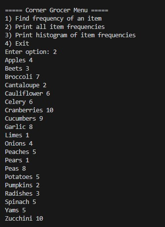
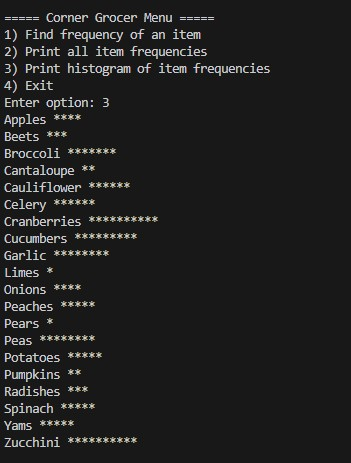

# Grocery Tracker (C++)

A C++ console application that reads grocery items from an input file, counts item frequency, and outputs results in multiple formats (including a histogram). This project demonstrates file I/O, maps, modular design, and clean console UX.

---

## Features
- Load grocery items from a text file
- Count item frequency using an in-memory map
- Menu-driven interface with multiple output options:
  - Display all items with counts
  - Query a single item’s frequency
  - Print a histogram of item frequency
- Writes an output data file (`frequency.dat`)

---

## Demo

**Print all item frequencies**

**Print histogram output**

---

## Tech Used
- C++ (standard library)
- File I/O (`ifstream` / `ofstream`)
- Associative containers (`std::map` or similar)
- Modular design with header/source separation

---

## Project Structure

    CS210-Portfolio/
      README.md
      Project3/
        main.cpp
        GroceryTracker.cpp
        GroceryTracker.hpp
        CS210_Project_Three_Input_File.txt
        frequency.dat

---

## How to Build and Run (Windows + g++)

# From repo root
g++ -std=c++17 -Wall -Wextra -O2 .\Project3\main.cpp .\Project3\GroceryTracker.cpp -o GroceryTracker.exe

# Run from Project3 (so the input file is found)
cd .\Project3
..\GroceryTracker.exe

---

## Input / Output Files
- **Input:** `Project3/CS210_Project_Three_Input_File.txt`
- **Output:** `Project3/frequency.dat`

---

## What This Demonstrates
- Translating a real-world counting problem into a working program
- Using data structures to efficiently aggregate results
- Building maintainable C++ code with separate compilation units
- Designing a simple, user-friendly CLI menu
